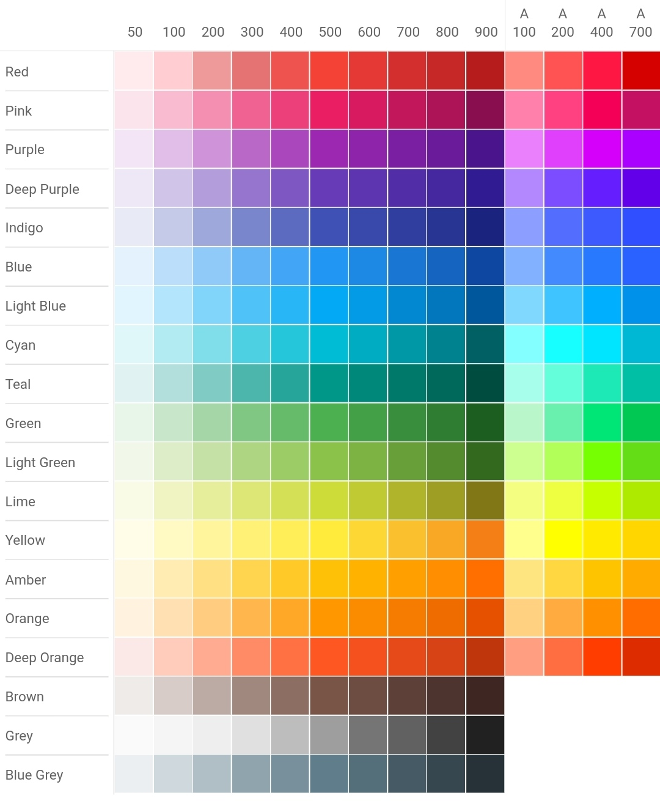

<p align="center">

</p>

<p align="center">

</p>

<h1 align="center">How To Use</h1>

### Step 1: Add the JitPack repository to your build file.
Add it in your root `build.gradle` / `build.gradle.kts` at the end of repositories:

Groovy:
```groovy
    allprojects {
        repositories {
            ...
            maven { url 'https://jitpack.io' }
        }
    }
```
Kotlin:
```kotlin
    allprojects {
        repositories {
            ...
            maven { 
                setUrl("https://jitpack.io")
            }
        }
    }
```

### Step 2:  Add the dependency
Groovy:
```groovy
    implementation 'com.github.atick-faisal:compose-material-color:5.1.1'
```
Kotlin:
```kotlin
    implementation("com.github.atick-faisal:compose-material-color:5.1.1")
```

### Step 3: Enjoy using Material Colors with Compose
```kotlin
    import ai.atick.material.MaterialColor
    
    ...
    
    Text(
        text = "Hello Compose!",
        color = MaterialColor.Purple700
    )
```

## License
[](https://creativecommons.org/licenses/by-nc-sa/4.0)

This work is licensed under [GNU General Public License v3.0](https://github.com/atick-faisal/PIC16F877a/blob/master/LICENSE). 
